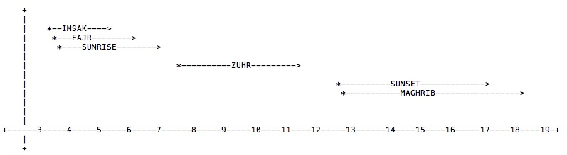
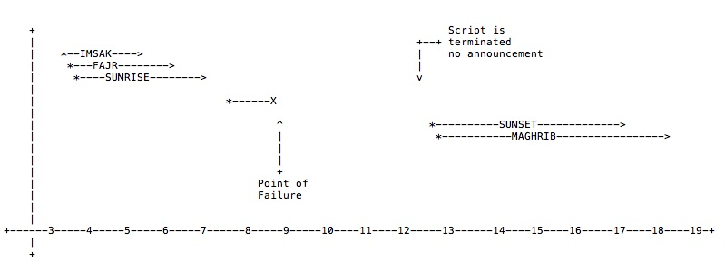
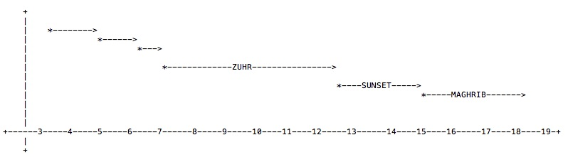
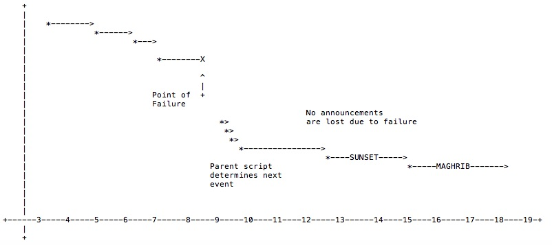

# sunrise

Set up the correct locale and timezone on the device
```
sudo raspi-config
```


## Installation: 

```
sudo apt-get install git
git clone https://github.com/pepsiplease69/sunrise.git
```
Afterwards, run the command

```
setup.sh
```
Afterwards, edit the cronjob.txt file and install the cronjobs

```
crontab -i cronjob.txt
crontab -l
```

Optional: Install mpg321 utility to play audio/mp3 files[^1]:

```
sudo apt-get install mpg321
```

[^1]:  Important side note.

If you are planning to use the 3.5mm audio jack on the raspberry pi to attach some speakers there and play audio that way, please be aware that, although this should work fine in most cases if you run headless and connect via ssh.

If at any point you connect a display to your HDMI port on the raspberry pi, the audio will start getting routed to the HDMI port instead of the 3.5mm audio jack. There's probably a way to override this behavior, but the easiest thing is to unplug HDMI and work over ssh when you're wanting to test speakers/audio.


## Configuration:
All of the configurable parameters are stored in a file called `config.pl`

Override the following variables to configure your geo-coordinates and altitude

```
$mylong     = +39.826;
$mylat      = +21.422;
$myalt      = 16.68;         # meters
```

The following variables can be customized to offset the times for imsak and isha, represented in minutes.

```
$fajrOffset       = 5;                 # time before astronomical twilight to announce imsak
$imsakOffset    = $fajrOffset + 5;     # warning shot before imsak
$ishaOffset       =  22;               # time after sunset to announce isha
```

After this each of the handler functions are defined which allows one to override/specify the tasks to be performed when an event occurs (typically some sort of announcement).

```
sub announce_sunrise
{
    get ( "http://10.0.1.187/cgi-bin/play.pl?file=sunrise" );     # does a fetch on a url
    #system ( "/usr/bin/mpg321 /home/pi/sounds/sunrise.mp3" );    # plays an mp3 file
}
```


## Scheduling considerations:

The scheduling of scripts can be performed in one of two ways:

- By directly invoking the scripts using daily cronjobs, or
- By invoking a parent script at boot up time

We will go over examples of both methods below.


### Direct Method:

When the scripts are invoked directly, the following has to be scheduled or the cronjob scheduler

```
# Minute   Hour   Day of Month       Month          Day of Week        Command    
# (0-59)  (0-23)     (1-31)    (1-12 or Jan-Dec)  (0-6 or Sun-Sat)                
#
    21      3          *             *                *            /home/pi/sunrise/03-sunrise.pl    > /dev/null 2>&1
    20      8          *             *                *            /home/pi/sunrise/04-zuhr.pl       > /dev/null 2>&1
    20      15         *             *                *            /home/pi/sunrise/05-sunset.pl     > /dev/null 2>&1
```

We see examples of 3 scheduled jobs invoking our scripts. 
- Sunrise job is kicked off at 3:21AM  
- Zuhr job is kicked off at 8:20AM
- Sunset job is kicked off at 3:20PM


(invokation times were selected well enough ahead of time for the event to occur in the future)

Once the script has been invoked, it calculates the time for the event and pauses and waits for the desired time to arrive, it then executes the announce handler and exits.





The approach mentioned above has a drawback. Although it's simpler, and offers more control, it is not fail-safe.

If, for example, cron kicks off sunrise job at 8:20AM and the job sits and waits till 12 noon or so.

If (at 9AM) the system goes through a reboot or loses power and has to be restarted, then the announcement for zuhr will be lost and will not occur ( without manual intervention ).



Instead we could go for an alternate approach explained below.


### Parent Job:

We can put a parent job on the crontab, to be invoked at boot up time. 

```

# Minute   Hour   Day of Month       Month          Day of Week        Command    
# (0-59)  (0-23)     (1-31)    (1-12 or Jan-Dec)  (0-6 or Sun-Sat)                
#

...

@reboot   /home/pi/sunrise/parent.sh >> /home/pi/sunrise/parent.log

```


This parent job kicks off each of the scripts in the proper succession. 

- If the event happens to have occurred in the past, the perl script will quietly output a message indicating that, and will not make any announcements and exit gracefully.
- If the event occurs in the future, then the perl script will block the processing and wait for the event

The parent job will invoke each of the scripts sequentially and at the end of last event, it will wait for the next day to start the next run.

 



If the device reboots for any reason or loses power inadvertently, then the next time it boots up, the parent script will run, and invoke all the scripts, in the correct order, as usual.

The scripts for the events that have already occurred in the past, will do nothing and will not block execution and will exit immediately, returning control back to the parent script.

Execution will ultimately arrive at the script that has to wait for an event to occur in the future. The script will block execution there (this is the desired behavior).



And this is how an event/announcement which would have otherwise been missed due to a reboot or failure, will now still occur, because we've now built-in some logic to figure out where we are (which part of the day) and what to wait for next.

This logic comes into effect right at boot up time.

The code for the parent job looks like the following:

```

while ( 1 )
    ~/sunrise/01-imsak.pl
    ~/sunrise/02-fajr.pl
    ~/sunrise/03-sunrise.pl
    ~/sunrise/04-zuhr.pl
    ~/sunrise/05-sunset.pl
    ~/sunrise/06-maghrib.pl
    ~/sunrise/wait_for_tomorrow.sh
end

```


